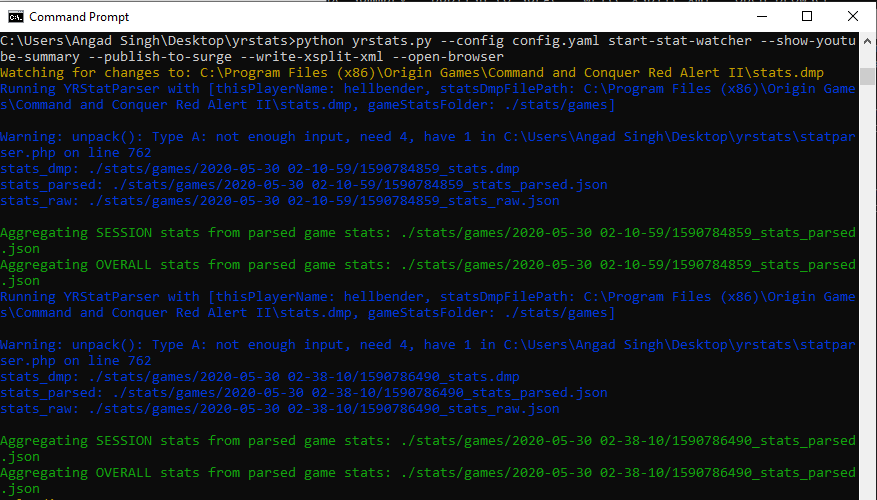
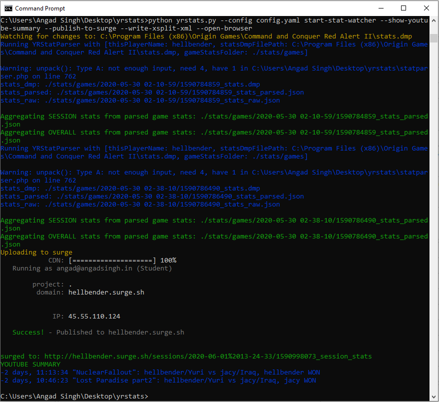
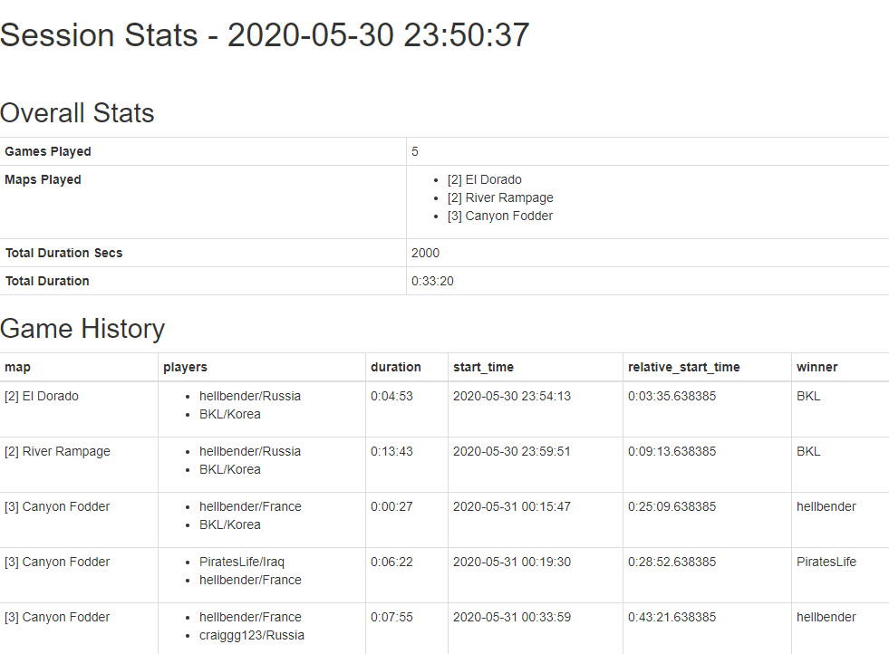
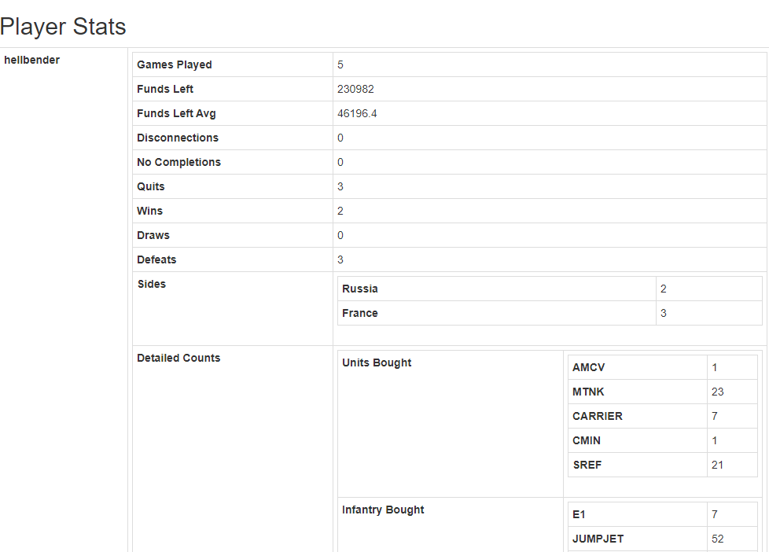

# YRStats.py

A simple command line utility to easily capture and share game stats for your [Command & Conquer Red Alert: Yuri's revenge](https://en.wikipedia.org/wiki/Command_%26_Conquer:_Yuri%27s_Revenge) games.

### What can YRStats.py do?

- Automatically extract game stats from the game's `stats.dmp` file after every game, parse them and store them in a readable `JSON` format in a timestamped fashion for archival (credits for the `stats.dmp` parsing code go to the [CNCNet Ladder project](https://github.com/CnCNet/cncnet-ladder-api))
- Create and update `session` stats - with session game history, aggregated session stats for each player to the lowest detail - from wins and losses, teams used, maps played to how many of each kind of units were built, captured or killed.
- Create and update `overall` stats for all the games captured so far
- A simple and intuitive command line interface based on python's [click](https://palletsprojects.com/p/click/) project, stats.dmp file watcher using the [watchdog](https://pythonhosted.org/watchdog/) project, stats shown in simple HTML using [json2html](https://github.com/softvar/json2html) and colored terminal output using [colorama](https://github.com/tartley/colorama)
- Helper functionality for game streamers:
  - Show an optional youtube description summary at the end of a gaming session
  - Upload the `session` stat and `overall` stat HTML and css to your free [surge.sh](http://surge.sh/) website to sharing the links with other gamers (on in your youtube stream's description)
  - Can host a built-in webserver to serve your stats
  - Write and update a [streamcontrol](http://farpnut.net/streamcontrol/) compatible XML file so that you can overlay a game session scoreboard on your youtube/twitch stream using [XSplit broadcaster](https://www.xsplit.com/broadcaster) or [OBS](https://obsproject.com/)!
- Demo videos [[1]](https://www.youtube.com/watch?v=vI2HIdtdUO4) [[2]](https://youtu.be/8v6yw01jzfU)

### Installation

1. Download a zip of this project
2. Install php 7.x for [windows](https://windows.php.net/downloads/releases/php-7.4.6-nts-Win32-vc15-x64.zip)
3. Install python 3.8.x for [windows](https://www.python.org/ftp/python/3.8.3/python-3.8.3.exe)
4. Run `curl -s https://bootstrap.pypa.io/get-pip.py | python` to install pip
5. Install dependencies of `yrstats`: `pip install -r requirements.txt`
6. Configure the `config.yaml` (instructions below)
7. Run `yrstats.py`

### Usage

The command line interface is pretty self explanatory:

```bash
> python yrstats.py --help
Usage: yrstats.py [OPTIONS] COMMAND [ARGS]...

Options:
  --config PATH  Path to the config.yaml file containing configuration params
                 for this utility  [required]

  --help         Show this message and exit.

Commands:
  extract-game-stats    Extract game stats for the last game from stats.dmp,
                        save it in game stats folder and exit

  start-stat-watcher    Start the stat server to continuously monitor and
                        parse stat.dmp and keep updating game-level, session-
                        level as well as overall stats

  update-overall-stats  Generate overall stat data from the parsed games in
                        the game stats folder

  update-session-stats  Generate session stat data from the parsed games in
                        the game stats folder
```

And then each command can show its own help:

```bash
> python yrstats.py extract-game-stats --help
Usage: yrstats.py extract-game-stats [OPTIONS]

Options:
  --stat-dmp-file PATH  Full path to RA2 Yuri's Revenge stat.dump file, e.g.
                        C:\Program Files (x86)\Origin Games\Command and
                        Conquer Red Alert II\stats.dmp

  --help                Show this message and exit.
```

```bash
python yrstats.py start-stat-watcher --help
Usage: yrstats.py start-stat-watcher [OPTIONS]

Options:
  --stat-dmp-file PATH    Full path to RA2 Yuri's Revenge stat.dump file, e.g.
                          C:\Program Files (x86)\Origin Games\Command and
                          Conquer Red Alert II\stats.dmp

  --start-web-server
  --open-browser
  --show-youtube-summary
  --publish-to-surge
  --write-xsplit-xml
  --help                  Show this message and exit.
```

```bash
python yrstats.py update-session-stats --help
Usage: yrstats.py update-session-stats [OPTIONS]

Options:
  --since-today
  --since-last-n-days INTEGER
  --since-time [%Y-%m-%d|%Y-%m-%dT%H:%M:%S|%Y-%m-%d %H:%M:%S]
  --show-youtube-summary
  --help                          Show this message and exit.
```

```bash
python yrstats.py update-overall-stats --help
Usage: yrstats.py update-overall-stats [OPTIONS]

Options:
  --since-today
  --since-last-n-days INTEGER
  --since-time [%Y-%m-%d|%Y-%m-%dT%H:%M:%S|%Y-%m-%d %H:%M:%S]
  --help                          Show this message and exit.
```

### Configuration

You need to create `config.yaml` file and provide it to `yrstats.py` to run. Here's how it looks like:

```yaml
thisPlayerName: hellbender
statsDmpFilePath: "C:\\Program Files (x86)\\Origin Games\\Command and Conquer Red Alert II\\stats.dmp"

#Local directory path where you want to keep the parsed game stat data
gameStatsFolder: ./stats/games

#Local directory path where you want to keep the aggregated session stat data
sessionStatsFolder: ./stats/sessions

#Local directory path where you want to keep the aggregated overall stat data
overallStatsFolder: ./stats/overall

#Full path to the PHP executable - required to run statparser.php
phpExecutable: "C:\\Users\\Angad Singh\\Downloads\\php-7.4.6-nts-Win32-vc15-x64\\php.exe"

#path of the html_resources folder relative to the sessionStatsFolder
htmlResourcesRelPathSessions: ../../html_resources

#path of the html_resources folder relative to the sessionStatsFolder
htmlResourcesRelPathOverall: ../html_resources

htmlTemplateSessions: template_sessions.html
htmlTemplateOverall: template_overall.html

#run surge once in the stats folder to configure the host
surgeSessionPath: http://hellbender.surge.sh/sessions/
surgeFolder: ./stats

xsplitXmlTemplate: ./streamcontrol_template.xml
xsplitXmlTargetPath: C:\Users\Angad Singh\Desktop\StreamControl_0_3\streamcontrol.xml

playerAliases: 
  - - hellbender
    - <human player>
  - - jacy
    - BKL
    - DistanSingh
```

### Example usage

Whenever you play your game (e.g. on [CNCNet](http://cncnet.org/)), just run `yrstats.py` first, and if you stream, start your broadcaster before playing, and thats it, the utility will do its job in the background:

`> python yrstats.py --config config.yaml start-stat-watcher --show-youtube-summary --publish-to-surge --write-xsplit-xml --open-browser`



After you're done playing, just go to this window and press `ctrl+C` to stop. It'll then do the post-session work like uploading to surge, printing the youtube summary description, etc if you gave it those flags:



The above is just a fake example created by copying over some old `stats.dmp` files. After a real session, the youtube summary will look something like this:

```bash
0:03:11 "[4] Dusk Ravine LE v1.02": hellbender/Russia vs BKL/Iraq, BKL WON
0:11:58 "[8] Proving Grounds LE v1.06": hellbender/Libya vs BKL/Iraq, BKL WON
0:17:42 "Desert Island": hellbender/France vs BKL/Iraq, BKL WON
0:31:55 "[4] Dry Heat LE v1.07": hellbender/France vs BKL/Iraq, hellbender WON
1:14:20 "[2] All The Fury LE v2.02": hellbender/France vs BKL/Iraq, hellbender WON
1:29:53 "[6] Malibu Cliffs LE v1.16": hellbender/France vs BKL/Iraq, BKL WON
1:52:03 "NuclearFallout": hellbender/Yuri vs BKL/Iraq, hellbender WON
2:19:14 "Lost Paradise part2": hellbender/Yuri vs BKL/Iraq, BKL WON
```

If you copy this to your youtube video's description, the relative timestamps will become clickable automatically. To make sure these are accurate, start `yrstats.py` at the same time as your broadcaster or recorder (a few seconds here and there should be ok anyway).

Here's how the session stats HTML looks [like](http://hellbender.surge.sh/sessions/2020-05-30%2023-50-37/1590862837_session_stats):





### Advanced Usage
If you mess up your overall stats, you can always recreate them:

`> python yrstats.py --config config.yaml update-overall-stats --since-time "2020-05-30 00:00:00"`

OR

`> python yrstats.py --config config.yaml update-overall-stats --since-last-n-days 10`

You can even manually create a session:

`> python yrstats.py --config config.yaml update-session-stats --since-time "2020-05-30 00:18:56" --show-youtube-summary`

Or just extract stats for a single game (for testing?):

`> python yrstats.py --config config.yaml extract-game-stats --stat-dmp-file "C:\Program Files (x86)\Origin Games\Command and Conquer Red Alert II\stats.dmp"`

### Contributors Needed!
I need contributors for the following:
- figuring out building names for building codes in statparser.php
- converting statparser.php to python (someone with the knowledge of php's [unpack](https://www.php.net/manual/en/function.unpack.php) method's format specifiers)
- making the stats HTML more sexy, beyond just json2html :)
